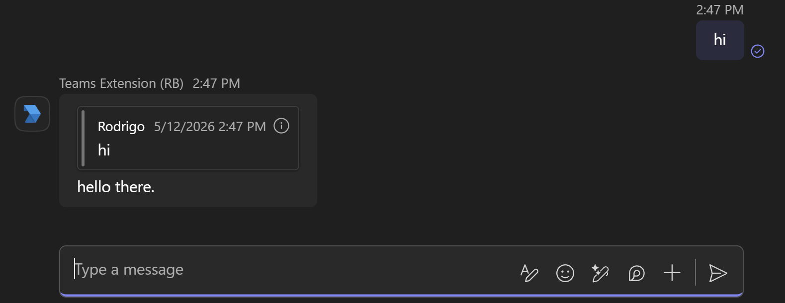
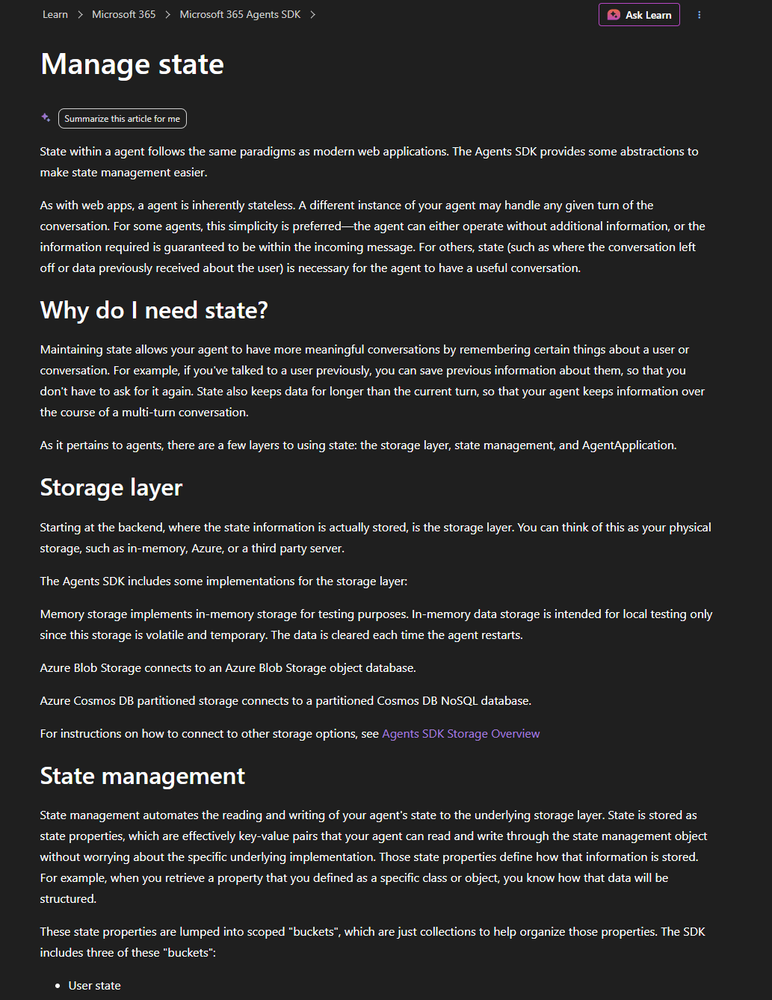
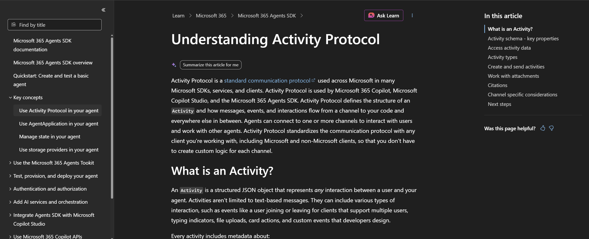
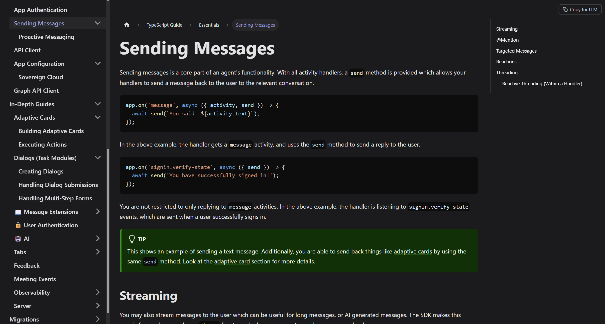

# M365 Agents SDK and Teams SDK

API and documentation comparisons.

## About this document

Most of this comparison is done with the TypeScript variants of each SDK. There are many features that are possible in the Agents SDK but are facilitated in the Teams SDK, and while an extra line or two might not be much here and there, for larger agents this may result in a non-insignificant amount of boilerplate and mental overhead for devs.

## Gaps

### Quotes

The Teams SDK provides several helpers to facilitate quoted messages. `ActivityContext.reply` adds a quote to the activity and sends it back to the user:

```ts
await context.reply('hello there')
```



Also in the SDK is a helper `ActivityContext.quote` that adds a quote to an `Activity` object using the id of an already-sent `Activity`.

There is no equivalent way to do this in the Agents SDK. See the [appendix](#reply-activities) for details on the payload the Teams SDK emits.

### Mentions

The Teams SDK's `MessageActivity`, which facilitates the create of Message activities, has a nifty helper for adding mentions.

Teams SDK

```ts
await context.send(
  new MessageActivity('hello ')
    .addMention(context.activity.from)
    .addText(', how are you?')
)
```

Agents SDK

```ts
const mention = {
    type: 'mention',
    mentioned: context.activity.from!,
    text: `<at>${context.activity.from?.name}</at>`
}

const replyActivity = MessageFactory.text(`hello ${mention.text}, how are you?`)
replyActivity.entities = [mention]
await context.sendActivity(replyActivity)
```

### Proactive

Currently in the Teams SDK there is no documented way to send a proactive message that starts a new conversation. Here it is in the Agents SDK:

```ts
const createOptions: CreateConversationOptions = CreateConversationOptionsBuilder
  .create(audience, 'msteams', context.activity.serviceUrl)
  .withUser(member.id)
  .withTenantId(context.activity.conversation?.tenantId ?? '')
  .build()

await app.proactive.createConversation(
  adapter,
  createOptions,
  async (context) => {
    await context.sendActivity(`Hello ${member.name}, this is a proactive message.`)
  })
```

However, given a conversation id, sending a proactive message is simple in the Teams SDK:

```ts
await app.send(conversationId, 'Hello')
```

In contrast, in the Agents SDK:

```ts
await app.proactive.continueConversation(
  adapter,
  conversationId,
  async (ctx: TurnContext, _state: TurnState) => {
    await ctx.sendActivity('Hello')
  }
)
```

### Teams Proactive Threading

I have yet to see or think of a use case where the Teams Channel id and the activity id are obtained separately and make this feature useful, but the Teams SDK docs feature this helper, so it is included here.

To send a proactive message to Teams Channel thread, the conversation id must be in the format:

`{TEAMS_CHANNEL_ID}messageid={ACTIVITY_ID}`

where `TEAMS_CHANNEL_ID` is the id of the Channel within a Teams Team and `ACTIVITY_ID` is the id of the root message of a thread.

The Teams SDKs have helpers for this construction. In TypeScript, this is the `toThreadedConversationId` function.

Again, I'm unsure of the utility of this helper. The samples that demonstrate it acquire the two ids by splitting an incoming conversation id, and they then reconstruct that conversation id.

### Graph Client

In the Python and .NET versions of the Teams SDK, an extra package needs to be installed to allow the `ActivityContext` (counterpart of`TurnContext`) to construct the Graph clients.

In TypeScript, `@microsoft/teams.graph` is already a dependency of `@microsoft/teams.apps`, so this extra step is not needed. Moreover, the TypeScript Teams SDK Graph package does not rely on the Graph SDK. Instead, it defines a lightweight HTTP client wrapper that is meant to be used with the `@microsoft/teams.graph-endpoints` package containing a large set of Graph endpoint builders. 

Across the languages, these packages inject into the `ActivityContext` a lazily-loaded Graph client that uses the app token and another that uses the user token.

Here is example usage of the app's Graph client in .NET

```c#
var user = app.Graph.Me.GetAsync().GetAwaiter().GetResult();
Console.WriteLine($"User ID: {user.id}");
Console.WriteLine($"User Display Name: {user.displayName}");
Console.WriteLine($"User Email: {user.mail}");
Console.WriteLine($"User Job Title: {user.jobTitle}");
```

In the Agents SDK for .NET, the GraphServiceClient would have to be manually instantiated with the user or app token. This is a small cost, but from a developer perspective, in the Teams SDK this takes 0 steps (as accessing the Graph field instantiates the client if it does not already exist) and it takes two steps in the Agents SDK to get the token, create the client, and a third step if client is to be persisted in a variable.

For more examples with .NET and TypeScript, see the [appendix](#graph-client-usage) section, which are taken for your convenience from this [document](https://microsoft.github.io/teams-sdk/csharp/essentials/graph).
 
### Cards

The Teams SDK provides a lot of adaptive card support. However, devs can also simply import the Teams SDK cards package and use it alongside the Agents SDK.

### Documentation

This part is very subjective. The Teams SDK documentation, in my opinion, is more inviting. Their docs feel less verbose. There are [portions](https://learn.microsoft.com/en-us/microsoft-365/agents-sdk/state-concepts) of our [docs](https://learn.microsoft.com/en-us/microsoft-365/agents-sdk/activity-protocol) that have a lot of text without many supporting visuals. Here is our doc on state management:



 Most of our docs do have a decent amount of code snippets, but other forms of visual are lacking. More schemas, architecture diagrams, and flow charts could be helpful.

 <br>

 There are also a few portions in `Key concepts` portion of our docs that seem overly verbose. Take, for example, our [description of typing activities](https://learn.microsoft.com/en-us/microsoft-365/agents-sdk/activity-protocol#typing):
 
 > A Typing type of Activity is a classification of activity to indicate someone is typing in a conversation. This activity is commonly seen between human to human conversations in Microsoft Teams client, for example. Typing activities aren't supported in every client. Notably, Microsoft 365 Copilot doesn't support typing activities.
 
 Meanwhile, here is the Teams SDK's description of `typing` activities:

> Sends a typing indicator to indicate the app got the user's message and is computing a response

<br>

Finally, I think the Teams SDK documentation benefits from its pacing.



Above is a screenshot of a [page](https://learn.microsoft.com/en-us/microsoft-365/agents-sdk/activity-protocol) in the Agents SDK documentation. Notice the left sidebar and the outline area on the right. Every link in the outline is a page that won't appear in folder structure for this doc, making it harder to navigate, especially for new users.



In the Teams SDK docs, each document is more self-contained. The sidebar on the left shows a more nested structure. Jumping from one topic to another is easier, in my experience.

Another advantage of this organization is the separation of topics based on depth and necessity. The Teams SDK document introduces topics slowly, and each page tends to have a narrower focus. A new user doesn't know the relevance of each topic or how much time to devote to each one unless we tell them explicitly or implicitly, and I think the Teams SDK documentation does both better than the Agents SDK.

## Appendix

### Reply Activities

At the time of writing this (5/12/2026), the `@microsoft/teams.api` package is on version 2.10.0, and the result of

```ts
const activity = await context.reply('hello there')
```

is

```python
{
  type: 'message',
  text: '<blockquote itemscope="" itemtype="http://schema.skype.com/Reply" itemid="1778622431758">\n' +
    '<strong itemprop="mri" itemid="<redacted>">Rodrigo</strong><span itemprop="time" itemid="1778622431758"></span>\n' +
    '<p itemprop="preview">hi</p>\n' +
    '</blockquote>\r\n' +
    'hello there.',
  replyToId: '1778622431758',
  from: {
    id: '<redacted>',
    name: 'bot-agents-e2e-agentic'
  },
  conversation: {
    conversationType: 'personal',
    tenantId: '<redacted>',
    id: '<redacted>'
  },
  id: '1778622434901'
}
```

However, the repo's main branch recently had an update that produces the following activity instead, which does not work in the Teams client I tested with. It is included here because this may indicate a [different approach and new support by Teams](https://github.com/microsoft/teams.ts/commit/bc4498d86aba21dc75016765b6968ff96e1e63b0).

```python
{
  type: 'message',
  id: '1778622006252',
  serviceUrl: undefined,
  timestamp: undefined,
  locale: undefined,
  localTimestamp: undefined,
  channelId: 'msteams',
  from: {
    id: '<redacted>',
    name: 'bot-agents-e2e-agentic'
  },
  conversation: {
    conversationType: 'personal',
    tenantId: '<redacted>',
    id: '<redacted>'
  },
  relatesTo: undefined,
  recipient: undefined,
  replyToId: undefined,
  entities: [
    {
      type: 'quotedReply',
      quotedReply: { messageId: '1778622003149' }
    }
  ],
  channelData: undefined,
  text: '<quoted messageId="1778622003149"/> hello there.',
  speak: undefined,
  inputHint: undefined,
  summary: undefined,
  textFormat: undefined,
  attachmentLayout: undefined,
  attachments: undefined,
  suggestedActions: undefined,
  importance: undefined,
  deliveryMode: undefined,
  expiration: undefined,
  value: undefined
}
```

### Graph Client Usage

App's Graph client usage in .NET:

```c#
var user = app.Graph.Me.GetAsync().GetAwaiter().GetResult();
Console.WriteLine($"User ID: {user.id}");
Console.WriteLine($"User Display Name: {user.displayName}");
Console.WriteLine($"User Email: {user.mail}");
Console.WriteLine($"User Job Title: {user.jobTitle}");
```

and the TS version:

```ts
app.graph.call(endpoints.me.get).then((user) => {
  console.log(`User ID: ${user.id}`);
  console.log(`User Display Name: ${user.displayName}`);
  console.log(`User Email: ${user.mail}`);
  console.log(`User Job Title: ${user.jobTitle}`);
});
```

Next, example usage of the user's Graph client in .NET:

```c#
var user = await context.UserGraph.Me.GetAsync();
Console.WriteLine($"User ID: {user.id}");
Console.WriteLine($"User Display Name: {user.displayName}");
Console.WriteLine($"User Email: {user.mail}");
Console.WriteLine($"User Job Title: {user.jobTitle}");
```

and the TS verison:

```ts
const me = await userGraph.call(endpoints.me.get);
console.log(`User ID: ${me.id}`);
console.log(`User Display Name: ${me.displayName}`);
console.log(`User Email: ${me.mail}`);
console.log(`User Job Title: ${me.jobTitle}`);
```
