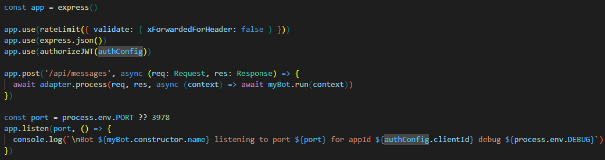

# Migration to @microsoft/agents-bot-hosting

This document outlines the necessary migrations to adapt BotBuilder samples for use with the Agents SDK.
These are the main steps to considerate:

## 1. Replace Imports  
Update all `botbuilder` imports to use the new SDK libraries:  
- `botframework-schema` → `agents-activity-schema`  
- `botbuilder` → `agents-bot-hosting`  
- `botbuilder-azure-blobs` → `agents-bot-hosting-storage-blob`  
- `botbuilder-azure/cosmosDb` → `agents-bot-hosting-storage-cosmos`  

## 2. Update Classes and Methods  
The following classes and methods have had significant modifications, requiring updates in the sample bots:

### a. ConfigurationBotFrameworkAuthentication  
- Replaced by `AuthConfiguration`, which can be instantiated using `loadBotAuthConfigFromEnv` or `loadAuthConfigFromEnv`.  
- `MicrosoftAppType` has been removed from the configuration, as it is now handled internally by the SDK.  
- While `loadBotAuthConfigFromEnv` maintains compatibility with the previous authentication format, `loadAuthConfigFromEnv` follows the updated format:  

  | Old Variable              | New Variable   |  
  |---------------------------|---------------|  
  | `MicrosoftAppId`          | `clientId`    |  
  | `MicrosoftAppPassword`    | `clientSecret`|  
  | `MicrosoftAppTenantId`    | `tenantId`    |  

### b. StatePropertyAccessor  
- Replaced by `BotStatePropertyAccessor`.  
- Since the methods are now asynchronous, their names have changed to include the "Async" suffix (e.g., `get` → `getAsync`).  

### c. Activity  
- Object literals can no longer be used as an `Activity`. Instead, use `MessageFactory` and its properties to create `Activity` objects.  
- **Conversation references** are now managed by `Activity` instead of `TurnContext`. The following methods have been moved to the `Activity` class:  
  - `getConversationReference`  
  - `applyConversationReference`  
  - `getReplyConversationReference`  
- `Activity` can now be instantiated using its constructor.  

### d. Storage  
- `BlobsStorage` has been replaced by `AzureBlobStorage`.  
- Token Credential authentication is not available. Authentication must now use a connection string.  

## 3. Server Changes  
Use **Express** instead of Restify for compatibility with the Agents server. Follow these steps:  
  1. Create an instance of an Express application to handle HTTP requests.  
  2. Implement rate limiting to prevent excessive API requests.  
  3. Parse incoming request bodies as JSON, allowing the bot to process structured data.  
  4. Apply JWT authentication using the `authorizeJWT` middleware.  
  5. Intercept `POST` requests to the `/api/messages` endpoint and use the adapter’s `process` method.  
  6. Listen for incoming requests on the specified port.  
  

## 4. SSO Authentication  
