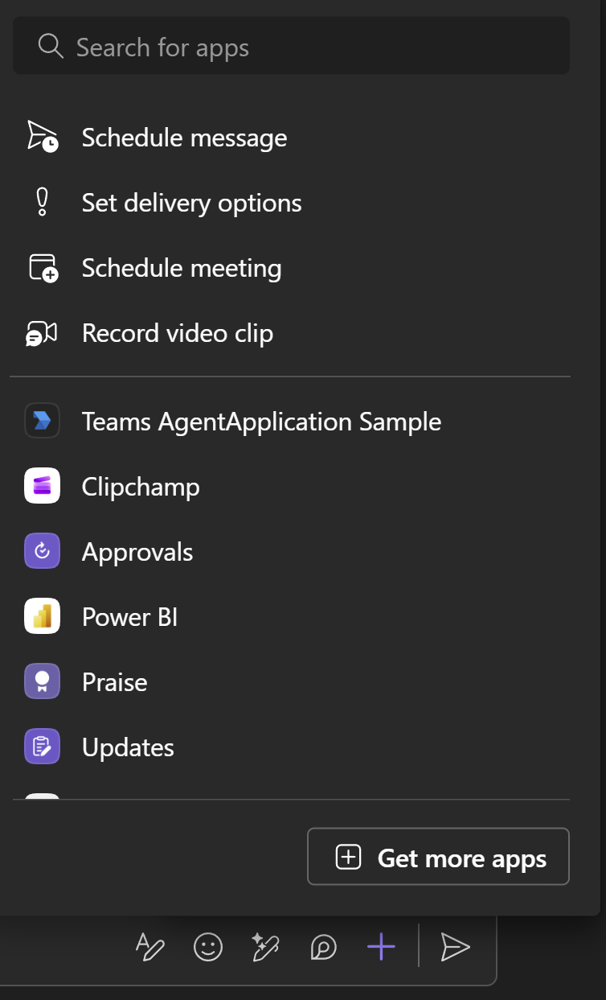
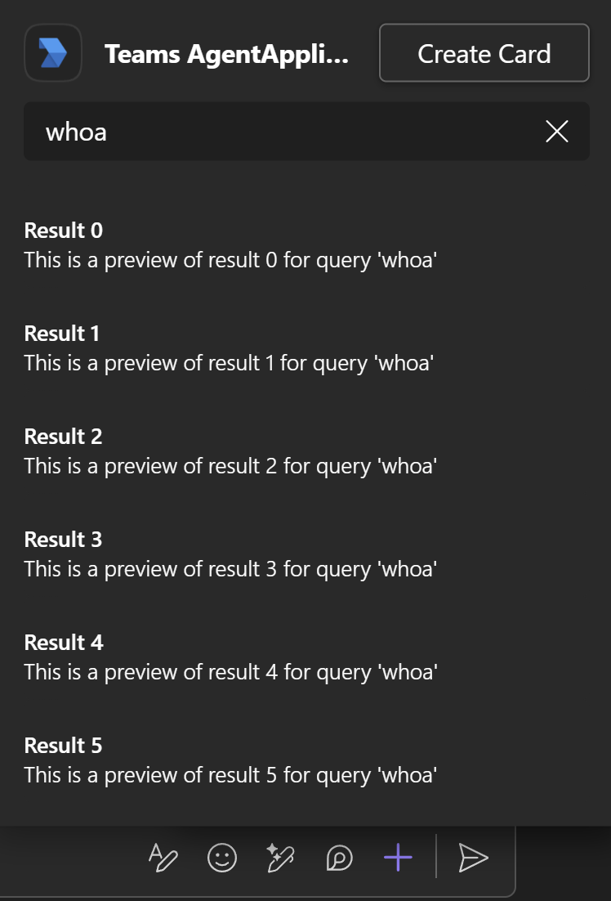
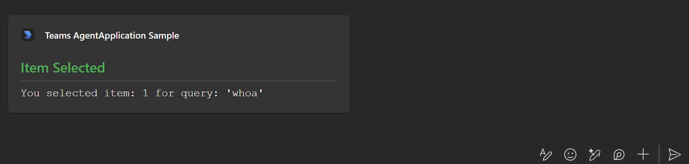
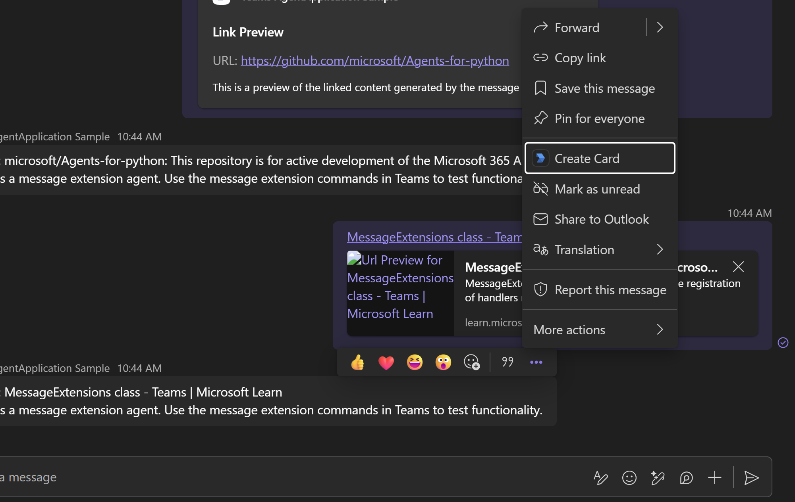
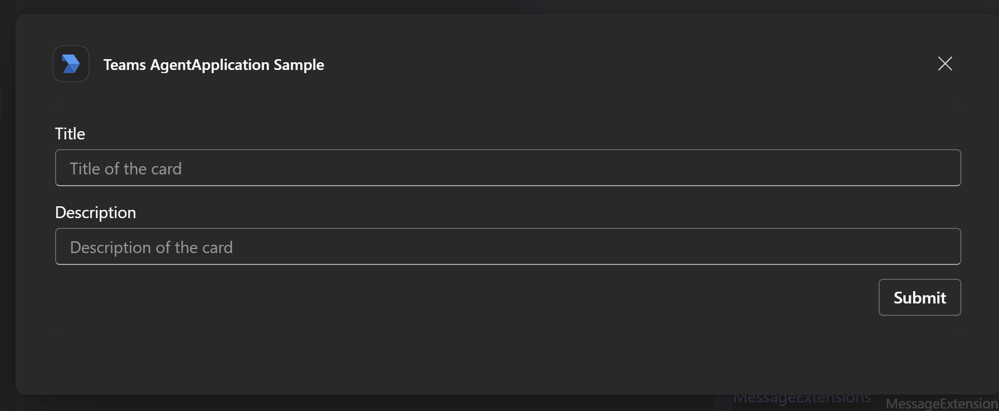
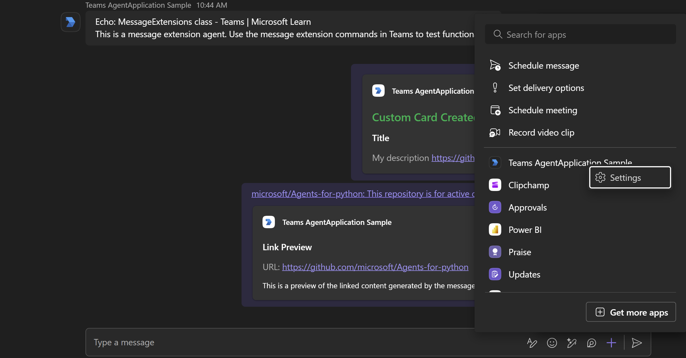
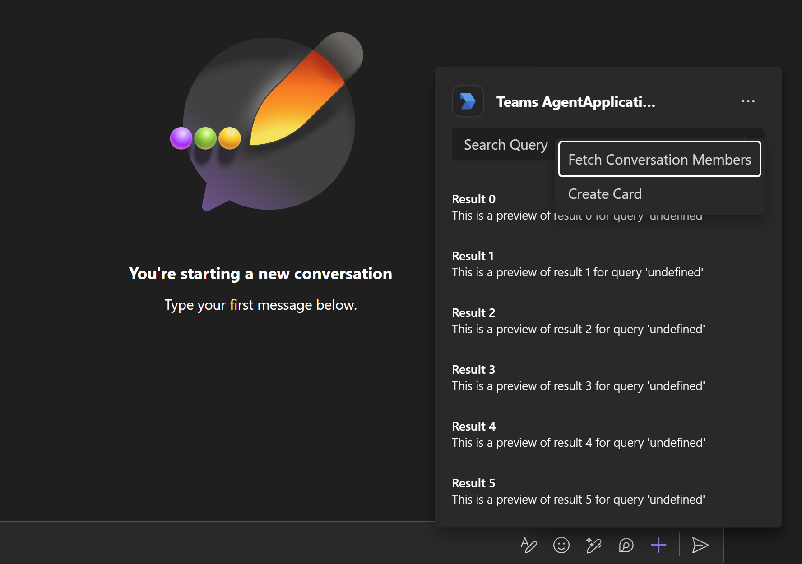
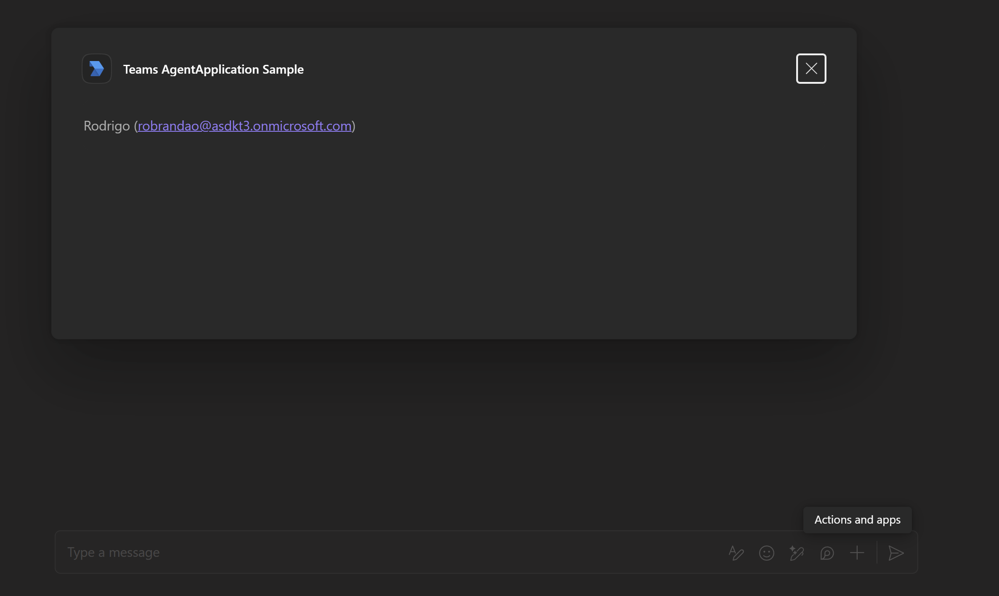

## Notes

Here is how to observe the functionality of the routes in a 1:1 chat with the agent:

- onQuery: press the '+' symbol in the compose box (the message box). The agent's name should be an option in the compose area (the popup that shows up). Clicking on it will invoke the onQuery route. The query results shown are a result of that route.

Typing into the query bar will invoke the route again

- onSelectItem: clicking on one of the query results from above will trigger this route. In this sample, this will create an AdaptiveCard in the user's chat box.

- onSubmitAction: There are a couple of ways to get here, but if you right click anywhere in the chat, you can hit the `Create Card` option (this is configured in the app manifest).

It should show a form:

Filling out and then submnitting that form will trigger this route, which creates a card in the user's chat box.

- onQueryLink: In this sample, under `composeExtension.messageHandlers`, by default the domain name `github.com` is provided, so sending a message with that domain will trigger this route:

- onConfigurationQuerySettingsUrl: open up the compose area again and right click agent's name. This will trigger this event, and the `Settings` option will take a moment to load. Once that is done, you can click it and be redirected to the settings form provided by this sample. Unforunately, the complementing onConfigurationSetting route is not hooked up properly. Also, because of the JWT middleware, the HTML document won't load unless JWT is disabled. This is will be refined.

- onFetchTask: compose area > agent name > triple dots > 'Fetch Conversation Members'

Clicking on that results in the following window:

